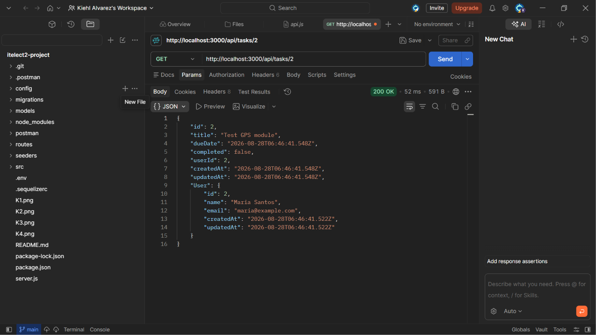
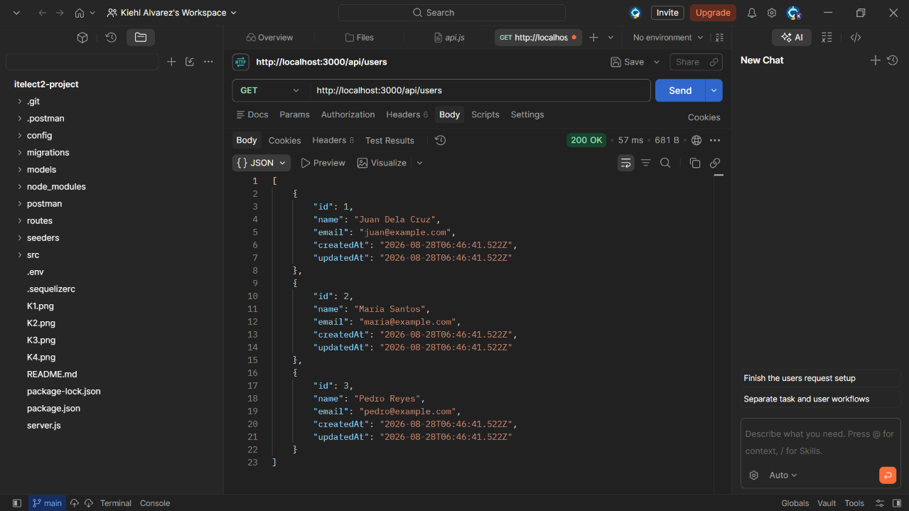
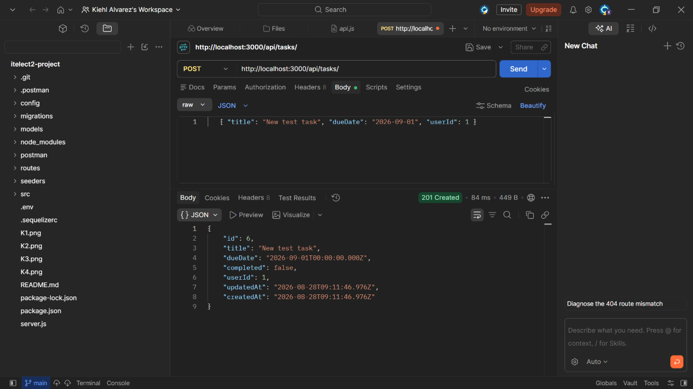
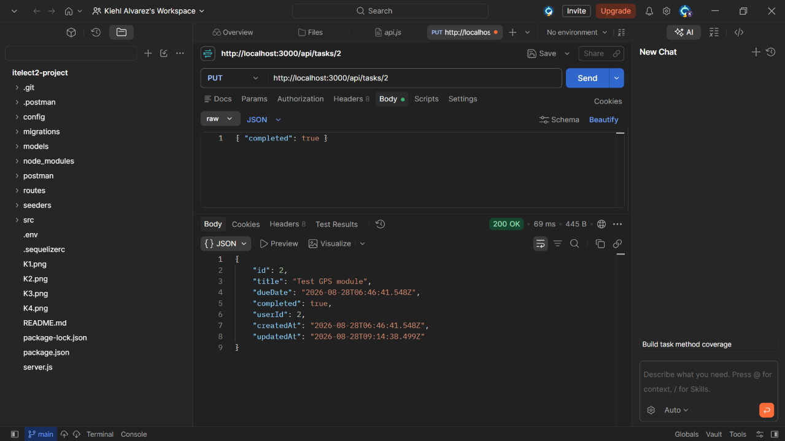
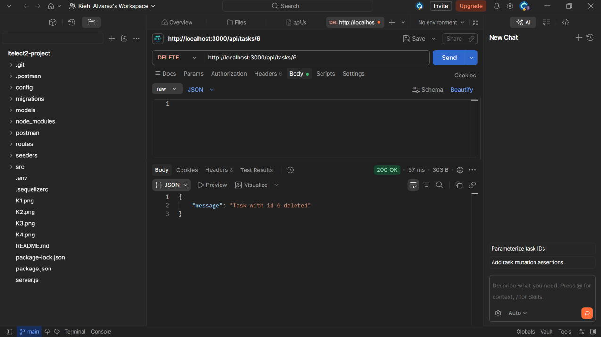
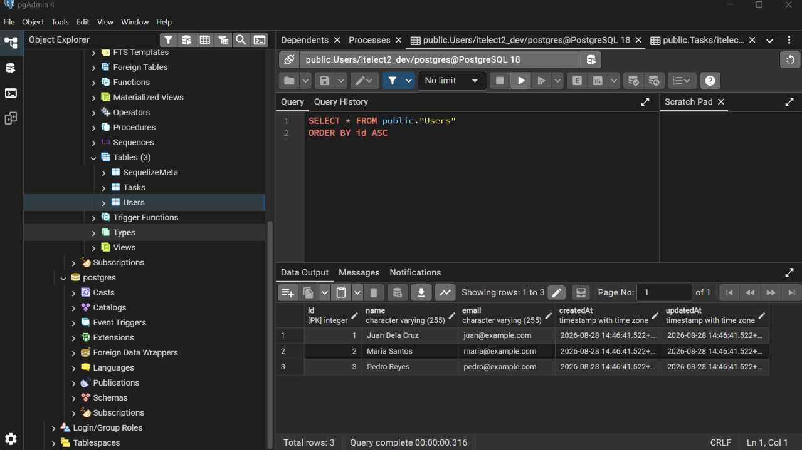
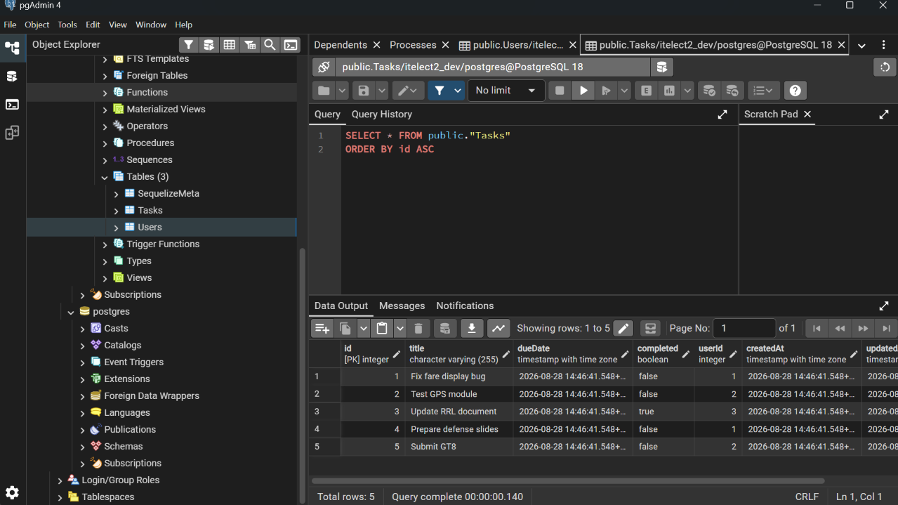

# itelect2-project

**My IT Elective 2 backend web development project in IT3C Section.**

## API TESTING

### GET /api/tasks
Returns all tasks, including the owning user (JOIN).

### GET /api/tasks/:id
Returns a single task with its owning user.

### POST /api/tasks
Creates a new task. userId is looked up from real users in the database.

### PUT /api/tasks/:id
Updates an existing task.

### DELETE /api/tasks/:id
Deletes a task by id.

### GET /api/users
Returns all users.

### Database Verification (pgAdmin)
Confirming seeded data directly in PostgreSQL.

**Users table (3 rows)**

**Tasks table (5 rows)**
