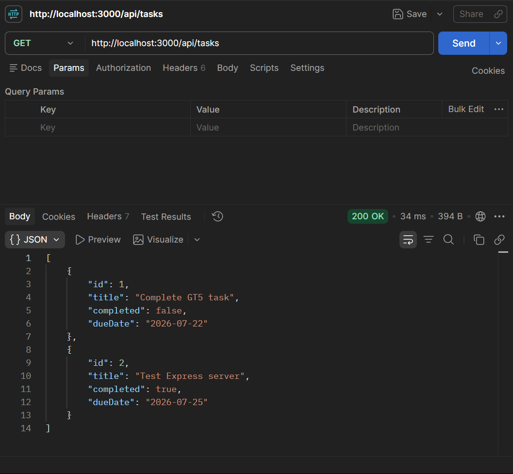
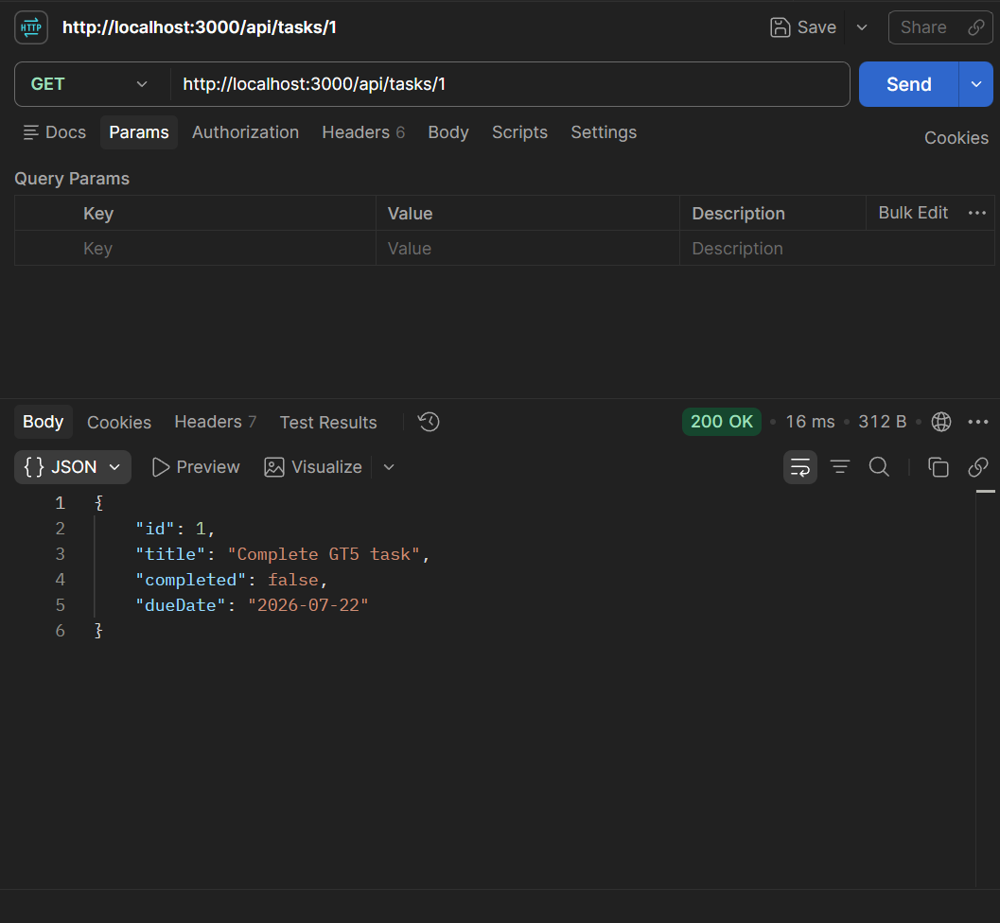
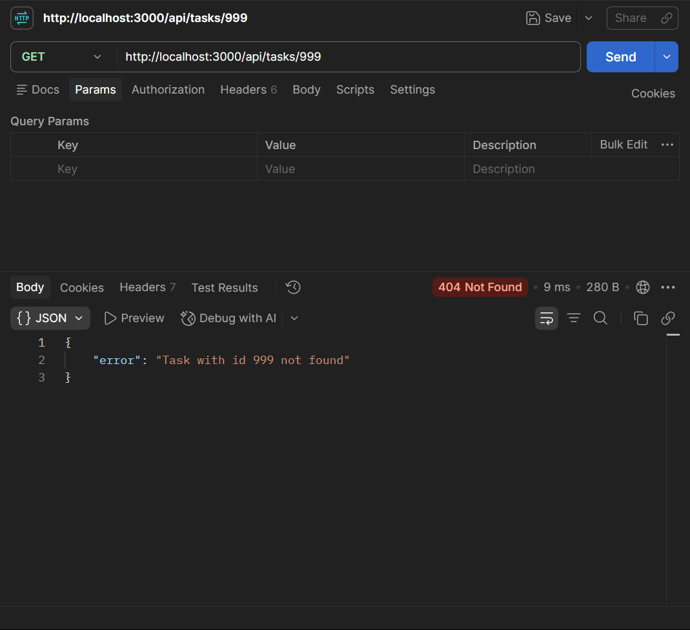
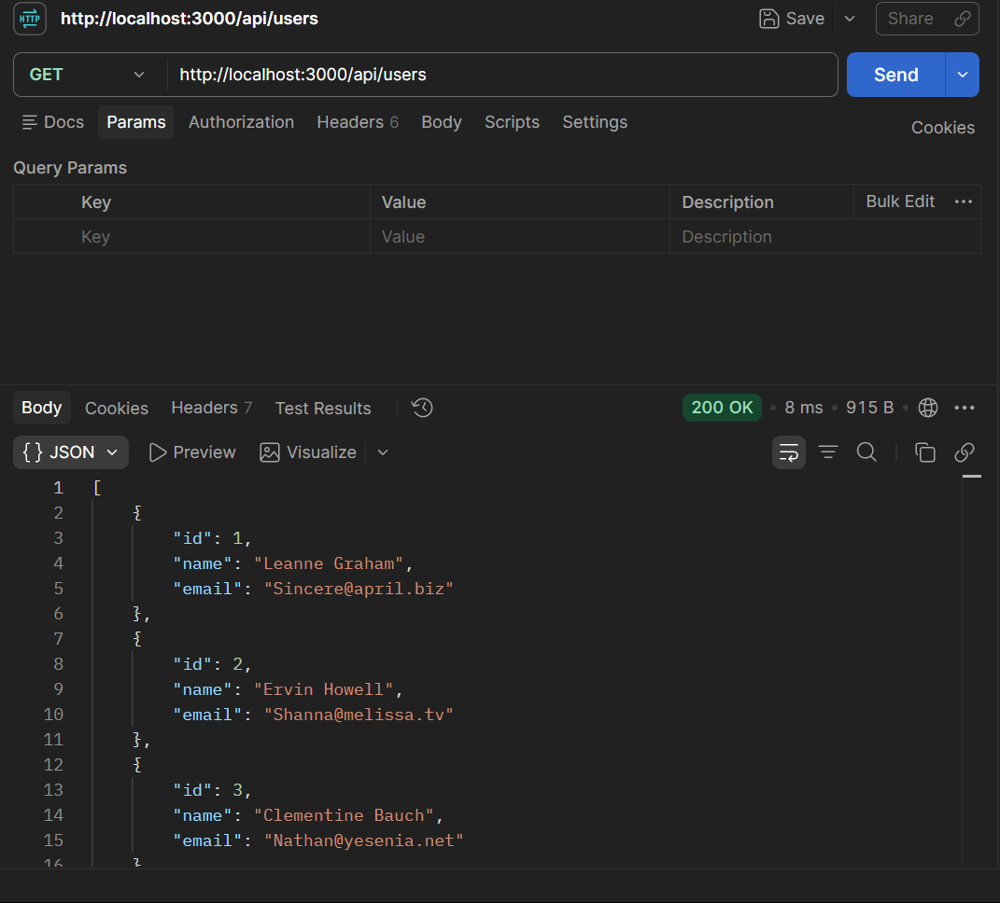

# itelect2-project

**My IT Elective 2 backend web development project in IT3C Section.**

## API Testing 

### 1. Get All Tasks
**Endpoint:** `GET /api/tasks`  
**Description:** Returns the complete list of mock tasks in JSON format.

---

### 2. Get Single Task by ID
**Endpoint:** `GET /api/tasks/:id`  
**Description:** Fetches a specific task matching the URL parameter `id`.

---

### 3. Task Not Found Error
**Endpoint:** `GET /api/tasks/999`  
**Description:** Returns a `404 Not Found` status and an error message when no task matches the given ID.

---

### 4. Get Cached Users
**Endpoint:** `GET /api/users`  
**Description:** Returns the transformed `{ id, name, email }` user list fetched once on server startup.

